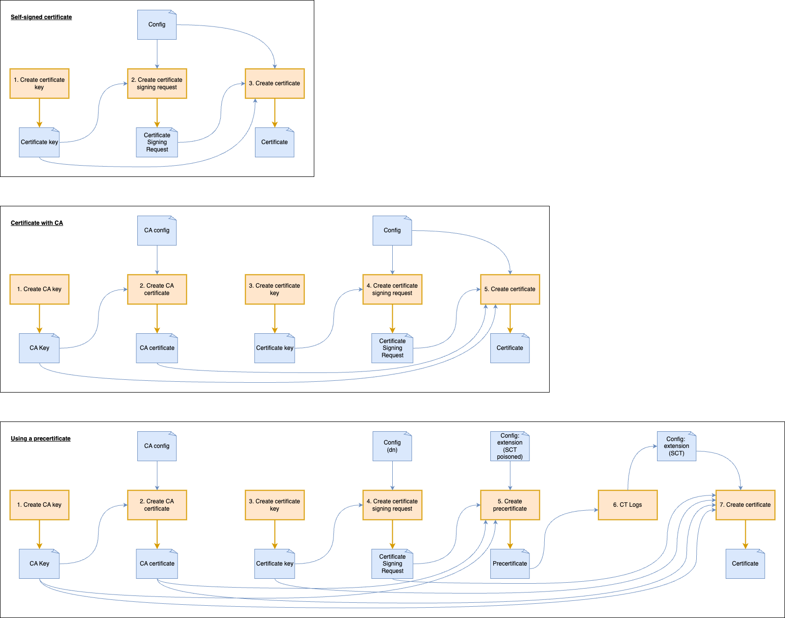

# Certificates demo


## Setup

**Start docker:**
```bash
docker-compose up -d
```

**Test docker:**
```bash
curl http://localhost:10000/

curl -H 'Host: server-one' http://localhost:10000/

curl -H 'Host: server-two' http://localhost:10000/

curl --resolve server-one:10000:127.0.0.1 http://server-one:10000/

curl --resolve server-two:10000:127.0.0.1 http://server-two:10000/
```

## Diagram


