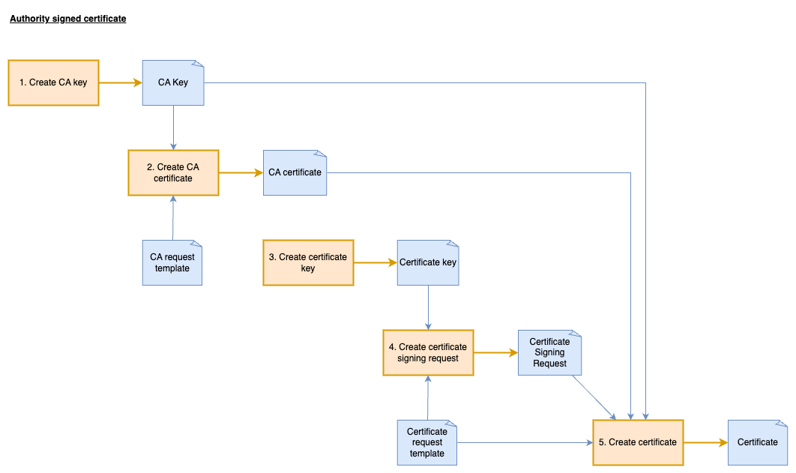

# Certificate authority signed certificates

Return [home](../README.md)

Using a custom Certificate Authority (CA) for local development simplifies security by requiring you to trust just one root certificate instead of multiple self-signed ones. Once your system trusts your local CA, you can easily generate and use certificates for any number of development services without additional trust configuration, creating a more realistic and streamlined secure development environment.




## Create the certificate authority

A certificate authority is essentially a special type of self-signed certificate that's designated specifically for signing other certificates, rather than serving as an end-entity certificate installed on servers or clients. The key difference lies in its extensions and parameters that establish it as a trusted issuer within a PKI hierarchy.

### Create the private key

Certificate authorities typically use larger key sizes (such as 4096-bit RSA) compared to server certificates (often 2048-bit) because the CA's key has greater security implications - if compromised, all certificates signed by that CA would be affected, potentially impacting thousands of systems rather than just a single server.

```bash
openssl genrsa -out ssl/casigned/ca.key 4096
```

### Create the certificate

Creating a root CA certificate involves a direct, self-signed process without requiring a separate CSR step. We're using a configuration file to define important CA-specific extensions and attributes that distinguish it as a certificate issuer rather than an end-entity certificate. The detailed settings in the [ca config](../ssl/casigned/ca.cnf) file establish critical parameters like key usage constraints and basic constraints that define this as a CA certificate.

Certificate authorities typically have much longer validity periods than server certificates. In this example, we're creating the CA certificate with a 10-year lifespan (3650 days), while the server certificates will only be valid for 1 year (365 days). This reflects real-world practice where CA certificates need to remain valid for all certificates they issue throughout their operational lifetime.

```bash
openssl req -new \
-x509 \
-days 3650 \
-key ssl/casigned/ca.key \
-config ssl/casigned/ca.cnf \
-extensions req_ext \
-out ssl/casigned/ca.pem
```

### Read details of the certificate

```bash
openssl x509 -in ssl/casigned/ca.pem -text -noout
```

When examining the CA certificate compared to the previously created self-signed certificate, you'll notice several important differences, particularly in the extensions section. The CA certificate will have the CA:TRUE flag in the Basic Constraints and different Key Usage values that permit certificate signing. These distinguishing features define the certificate's role in the PKI hierarchy:

```bash
openssl x509 -in ssl/casigned/ca.pem -text -noout > ssl/casigned/ca.pem.txt

diff --color=always --side-by-side ssl/selfsigned/certificate-1.pem.txt ssl/casigned/ca.pem.txt
git diff --no-index --word-diff ssl/selfsigned/certificate-1.pem.txt ssl/casigned/ca.pem.txt
```


## Create the server certificates

Now that we've established our Certificate Authority, we'll create server certificates that will be signed by this CA.

### Create the private key
```bash
openssl genrsa -out ssl/casigned/servers.key 2048
```


### Certificate Signing Request

A Certificate Signing Request (CSR) is a formal message sent from an applicant to a Certificate Authority containing the public key and identity information to be included in the certificate, which allows the CA to verify the requestor's identity and generate a signed certificate.

While not strictly necessary, using a CSR for self-signed certificates provides valuable separation between key generation and certificate creation, maintains consistency with standard certificate practices, and allows for precise configuration of certificate attributes and extensions—making it easier to transition to CA-signed certificates later if needed.

Each server requires its own Certificate Signing Request with specific configuration settings for its intended domain name and usage. This ensures certificates are properly scoped to their individual servers.

You can examine the differences between configurations:
```bash
diff --color=always --side-by-side ssl/casigned/server-one.cnf ssl/casigned/server-two.cnf
```

**Create the signing requests:**
```bash
openssl req -new \
-key ssl/casigned/servers.key \
-config ssl/casigned/server-one.cnf \
-out ssl/casigned/server-one.csr

openssl req -new \
-key ssl/casigned/servers.key \
-config ssl/casigned/server-two.cnf \
-out ssl/casigned/server-two.csr
```

Compare the CSRs:
```bash
openssl req -in ssl/casigned/server-one.csr -text -noout > ssl/casigned/server-one.csr.txt

openssl req -in ssl/casigned/server-two.csr -text -noout > ssl/casigned/server-two.csr.txt

diff --color=always --side-by-side ssl/casigned/server-one.csr.txt ssl/casigned/server-two.csr.txt
git diff --no-index --word-diff ssl/casigned/server-one.csr.txt ssl/casigned/server-two.csr.txt
```

### Create certificates

**Create the certificates with the Certificate Authority:**
```bash
openssl x509 -req \
-days 365 \
-in ssl/casigned/server-one.csr \
-CA ssl/casigned/ca.pem \
-CAkey ssl/casigned/ca.key \
-CAcreateserial \
-extensions req_ext \
-extfile ssl/casigned/server-one.cnf \
-out ssl/casigned/server-one.pem

openssl x509 -req \
-days 365 \
-in ssl/casigned/server-two.csr \
-CA ssl/casigned/ca.pem \
-CAkey ssl/casigned/ca.key \
-CAcreateserial \
-extensions req_ext \
-extfile ssl/casigned/server-two.cnf \
-out ssl/casigned/server-two.pem
```

Compare the two server certificates:
```bash
openssl x509 -in ssl/casigned/server-one.pem -text -noout > ssl/casigned/server-one.pem.txt
openssl x509 -in ssl/casigned/server-two.pem -text -noout > ssl/casigned/server-two.pem.txt

diff --color=always --side-by-side ssl/casigned/server-one.pem.txt ssl/casigned/server-two.pem.txt
git diff --no-index --word-diff ssl/casigned/server-one.pem.txt ssl/casigned/server-two.pem.txt
```

Compare `server-one` certificate with the certificate authority:
```bash
diff --color=always --side-by-side ssl/casigned/ca.pem.txt ssl/casigned/server-one.pem.txt

git diff --no-index --word-diff ssl/casigned/ca.pem.txt ssl/casigned/server-one.pem.txt
```

Compare the signing request against the certificate:
```bash
diff --color=always --side-by-side ssl/casigned/server-one.csr.txt ssl/casigned/server-one.pem.txt
git diff --no-index --word-diff ssl/casigned/server-one.csr.txt ssl/casigned/server-one.pem.txt
```

### Verify that a certificate was issued by an authority

The certificate for server one was signed by the certificate authority so verification should pass:
```bash
openssl verify -CAfile ssl/casigned/ca.pem ssl/casigned/server-one.pem 
openssl verify -CAfile ssl/casigned/ca.pem ssl/casigned/server-two.pem 
```

Our self-signed certificate was not signed by the certificate authority so ***verification should fail***:
```bash
openssl verify -CAfile ssl/casigned/ca.pem ssl/selfsigned/certificate-1.pem
```


## Testing

### Install certificates

**Enable SSL in nginx:**

Update both server configs in [nginx config](../docker/nginx.conf) to use certificates `server-one.pem` and `server-two.pem` and restart the container:

```text
server {
    listen 80 ssl;
    server_name server-one;

    ssl_certificate     /etc/nginx/ssl/casigned/server-one.pem;
    ssl_certificate_key /etc/nginx/ssl/casigned/servers.key;
    ....
}

server {
    listen 80 ssl;
    server_name server-two;

    ssl_certificate     /etc/nginx/ssl/casigned/server-two.pem;
    ssl_certificate_key /etc/nginx/ssl/casigned/servers.key;
    ...
}
```

**Make a HTTPs request to the server using the CA certificate:**

```bash
curl --resolve server-one:10000:127.0.0.1 --noproxy '*' https://server-one:10000/ --cacert ssl/casigned/ca.pem
curl --resolve server-two:10000:127.0.0.1 --noproxy '*' https://server-two:10000/ --cacert ssl/casigned/ca.pem

curl --cacert ssl/casigned/ca.pem -H 'Host: server-one' https://localhost:10000/ --noproxy '*'
curl --cacert ssl/casigned/ca.pem -H 'Host: server-two' https://localhost:10000/ --noproxy '*'
```

### Identifying Certificate Authorities in Live Connections

When working in corporate environments with secure internet connections, network traffic is often routed through proxy servers that implement TLS inspection. These proxies terminate the original HTTPS connection and establish a new one with their own certificates. This can cause certificate validation issues since your system needs to trust the proxy's certificate authority rather than the website's original CA. Identifying which certificate authority is actually securing your connection becomes critical for proper certificate validation and troubleshooting.

```bash
openssl s_client -connect 127.0.0.1:10000 -servername server-one </dev/null | openssl x509 -noout -issuer
```

OpenSSL will return an error saying that it doesn't trust the server, however it will then return the issuer value:

```text
Connecting to 127.0.0.1
depth=0 CN=server-one
verify error:num=20:unable to get local issuer certificate
verify return:1
depth=0 CN=server-one
verify error:num=21:unable to verify the first certificate
verify return:1
depth=0 CN=server-one
verify return:1
DONE
issuer=CN=MyCertificateAuthority
```

## Next section

[Chain of Trust](./chain-of-trust.md)
