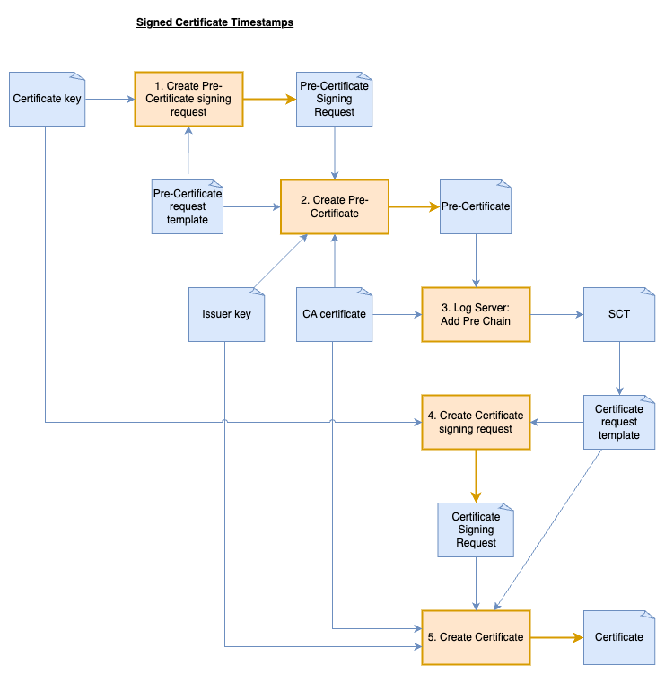

# Generating certificates with embedded SCTs

Return [Certificate Transparency Logs](../certificate-transparency-logs.md)

While public CT logs operated by Google, DigiCert, Cloudflare and others serve the global PKI ecosystem, running your own CT log server provides valuable hands-on learning opportunities. This exercise allows you to:
1. **Understand the complete CT workflow** by directly interacting with all components
2. **Experiment with precertificate submission** and observe the format differences
3. **Generate SCTs from your own log** that you can embed in test certificates
4. **Verify inclusion proofs** in a controlled environment
5. **Learn the verification mechanisms** that browsers implement

This practical experience with a local log server is purely educational - production certificates should always use established, trusted CT logs that are recognized by major browsers. The skills gained, however, provide deeper insights into certificate transparency that are valuable for security professionals and PKI administrators.


## Start local log server:

Google's [Certificate Transparency Go](https://github.com/google/certificate-transparency-go) project provides a reference implementation of a CT log server that can be run locally for testing and educational purposes. This implementation functions as a "CT personality" layer on top of [Trillian](https://github.com/google/trillian), which serves as the underlying Merkle tree database.


**To run the local CT log server:**

1. Initialise the Git submodules with command: `git submodule update --init --recursive`. Then ensure both repositories are available in the submodules directory:
    - `submodules/certificate-transparency-go`
    - `submodules/trillian`
2. Start the log server:
    - If you're behind a proxy, you may need to set the GOPROXY environment variable
    - Run the CTFE script: `./scripts/ctfe.sh`

The script should create directory `docker/ctfe_config`. In that directory there is a configuration file `ct_server.cfg` and a root certificate called `fake-ca.cert`. To add your own certificates to the log, copy your root CA into the config directory and update the `roots_pem_file` parameter in `ct_server.cfg`. A restart of the `ctfe-1` container is required for the changes to take affect.

**Test server:**

The base URL of the local CT server should be `http://localhost:8080/logs`. Test that it's running by calling an endpoint:
```bash
curl --noproxy '*' http://localhost:8080/logs/ct/v1/get-roots

# Check the number of root CAs
curl --noproxy '*' --silent http://localhost:8080/logs/ct/v1/get-roots | jq '.certificates | length'

# View the details of the first root CA
curl --noproxy '*' --silent http://localhost:8080/logs/ct/v1/get-roots | jq -r '.certificates[0]' | base64 -d | openssl x509 -inform DER -text -noout
```


## Exercise: Creating and Submitting a Precertificate

To implement Certificate Transparency for your certificates, follow this workflow:



**Create a precertificate with the poison extension:**
```
1.3.6.1.4.1.11129.2.4.3 = critical,ASN1:NULL
```

**Prepare the `add-pre-chain` payload:**

```bash
# Base64 encode both certificates
ISSUER_DER_BASE64=$(openssl x509 -in issuer.pem -outform DER | base64 -w 0)
PRECERT_DER_BASE64=$(openssl x509 -in precert.pem -outform DER | base64 -w 0)

# Create the JSON payload
cat > add-pre-chain_data.json << EOF
{
  "chain": [
    "${PRECERT_DER_BASE64}",
    "${CA_DER_BASE64}"
  ]
}
EOF
```

**Submit to the precertificate to the CT log and save the response:**
```bash
curl --silent -X POST \
  -H "Content-Type: application/json" \
  -d @add-pre-chain_data.json \
  http://localhost:8080/logs/ct/v1/add-pre-chain
```

**Create the final certificate** with the SCT extension:
- Add the SCT extension with OID 1.3.6.1.4.1.11129.2.4.2 (the certificate config should not contain the poison extension)
- The certificate must be otherwise identical to ensure SCT validation

**Verify the SCT embedding:**
```bash
openssl x509 -in ../ssl/scts/final.pem -noout -text | grep -A 12 'CT Precertificate SCTs'
```

**Verify with the `ct-verify` script:**

To verify that your certificate contains valid SCTs from your local CT log server, you'll need to modify the ct-verify script first. The script normally uses Google's public log list to identify known CT logs, but your local server won't be in that list.

Open the [verify.ts](../ct-verify/src/verify.ts) file in the `ct-verify` directory and locate the `ctLogStore.addLog` call. Ensure the Log ID (which you can extract from your certificate's SCT) and the public key (found in the ct_server.cfg file) are correct.

Once the script is updated, run the verification with:
```bash
npm run ct-verify ../ssl/scts/final.pem ../ssl/chain-of-trust/ca.pem

# If you need a CA for an internal proxy server
export NODE_EXTRA_CA_CERTS=~/ca_bundle.pem
npm run ct-verify ../ssl/scts/final.pem ../ssl/chain-of-trust/ca.pem
```
