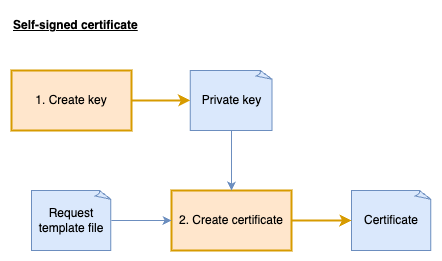

# Self-signed certificates

Return [home](../README.md)

Self-signed certificates are digital certificates that are created, issued, and signed by the same entity whose identity they certify, rather than by a trusted Certificate Authority (CA). While they provide the same encryption capabilities as CA-issued certificates, they lack third-party validation, causing browsers and clients to display trust warnings. Self-signed certificates are primarily useful for development environments, internal services, and testing scenarios where external validation isn't required.



## Create a private key

A private key is the secure cryptographic component that allows you to prove ownership of a certificate, decrypt data encrypted with the corresponding public key, and digitally sign content to verify your identity—it must be kept confidential at all times.

> Note: Private keys should never be committed to version control systems like GitHub, stored unencrypted on disk in deployed environments, or passed into an application on the CLI. Instead, use secure key storage solutions like key vaults.

**Create the key:**

The following command will create 2048 bit RSA key:
```bash
openssl genrsa -out ssl/selfsigned/private.key.pem 2048
```

**Check the details of the key:**

```bash
openssl pkey -in ssl/selfsigned/private.key.pem -text -noout

openssl asn1parse -in ssl/selfsigned/private.key.pem

openssl rsa -in ssl/selfsigned/private.key.pem -outform DER  2>/dev/null | xxd -c 1 -s 0 -l 30 --decimal
```

**Signing data and verification:**

The private key serves a crucial role in digital signatures, allowing you to sign data in a way that proves authenticity. Below is a practical demonstration of this process:

First, create the public key from the private key:
```bash
openssl pkey -in ssl/selfsigned/private.key.pem -pubout -out ssl/selfsigned/public.key.pem
```

Create a sample file and sign it with the private key:
```bash
echo "Signing test" > ssl/selfsigned/signing-test.txt
openssl dgst -sha256 -sign ssl/selfsigned/private.key.pem -out ssl/selfsigned/signing-test.sig ssl/selfsigned/signing-test.txt
```

Verify the signature using only the public key:
```bash
openssl dgst -sha256 -verify ssl/selfsigned/public.key.pem -signature ssl/selfsigned/signing-test.sig ssl/selfsigned/signing-test.txt 2>/dev/null
```

If the file is modified after signing, the verification will fail, demonstrating how digital signatures detect data tampering:
```bash
echo "extra data" >> ssl/selfsigned/signing-test.txt
openssl dgst -sha256 -verify ssl/selfsigned/public.key.pem -signature ssl/selfsigned/signing-test.sig ssl/selfsigned/signing-test.txt 2>/dev/null
```


## Create a certificate

**Create the certificate:**

The following command will create a certificate with 365 days validity:

```bash
openssl req -x509 -new -nodes \
  -sha256 \
  -days 365 \
  -key ssl/selfsigned/private.key.pem \
  -config ssl/selfsigned/certificate-1.cnf \
  -out ssl/selfsigned/certificate-1.pem
```

**Read details of the certificate:**
```bash
openssl x509 -in ssl/selfsigned/certificate-1.pem -text -noout
```

## Verify certificates key

To validate a self-signed certificate's authenticity, OpenSSL verifies that the certificate's signature was created using the private key corresponding to the public key contained within the certificate itself. This process confirms the certificate is self-contained and legitimate. The following command performs this verification by treating the certificate as both the certificate to verify and its own trusted CA:
```bash
openssl verify -CAfile ssl/selfsigned/certificate-1.pem ssl/selfsigned/certificate-1.pem
```

The certificates public key can also be compared against the actual public key:
```bash
# View certificates public key
openssl x509 -in ssl/selfsigned/certificate-1.pem -pubkey -noout | openssl pkey -pubin -outform DER | xxd

# View public key
openssl rsa -pubin -in ssl/selfsigned/public.key.pem -outform DER | xxd
```


## Installing the certificate

**Enable SSL in nginx and restart the container:**

Update the [nginx config](../docker/nginx.conf) and restart the container:
```
server {
    listen 80 ssl;
    server_name server-one;

    ssl_certificate     /etc/nginx/ssl/selfsigned/certificate-1.pem;
    ssl_certificate_key /etc/nginx/ssl/selfsigned/private.key.pem;
    ssl_protocols       TLSv1.2 TLSv1.3;
    ssl_ciphers         HIGH:!aNULL:!MD5;

    ....
}

server {
    listen 80 ssl;
    server_name server-two;

    ssl_certificate     /etc/nginx/ssl/selfsigned/certificate-1.pem;
    ssl_certificate_key /etc/nginx/ssl/selfsigned/private.key.pem;
    ssl_protocols       TLSv1.2 TLSv1.3;
    ssl_ciphers         HIGH:!aNULL:!MD5;

    ....
}
```

**Make a HTTPs request to the server:**

> Note: *This will return an untrusted certificate error*

```bash
curl --resolve server-one:10000:127.0.0.1 --noproxy '*' https://server-one:10000/
```

The SSL certificate warning can be bypassed using the `--insecure` flag, but this practice undermines security by accepting untrusted certificates and should be avoided:
```bash
curl --resolve server-one:10000:127.0.0.1 --noproxy '*' https://server-one:10000/ --insecure
```

Instead, provide the self-signed certificate as a trusted CA to the client:
```bash
curl --resolve server-one:10000:127.0.0.1 --noproxy '*' https://server-one:10000/ --cacert ssl/selfsigned/certificate-1.pem
```

**Request on different domain name:**

The original certificate was created specifically for the `server-one` domain name. However, our server is accessible through multiple hostnames and IP addresses including `localhost`, `127.0.0.1`, and also used for `server-two`. Try these commands to see how certificate validation fails when the hostname doesn't match what's in the certificate:

```bash
# Request host "server-one" but through hostname "localhost"
curl -H 'Host: server-one' --noproxy '*' https://localhost:10000/ --cacert ssl/selfsigned/certificate-1.pem

# Request host "server-one" but through IP address "127.0.0.1"
curl -H 'Host: server-one' --noproxy '*' https://127.0.0.1:10000/ --cacert ssl/selfsigned/certificate-1.pem

# Request host "server-two"
curl --resolve server-two:10000:127.0.0.1 --noproxy '*' https://server-two:10000/ --cacert ssl/selfsigned/certificate-1.pem
```

### Subject Name Alternatives

The self-signed certificate was originally created with only the server-one domain name, causing SSL verification to fail when accessing the server via localhost, even though the server itself defaults to serving the server-one content. This hostname mismatch triggers certificate validation errors because the certificate doesn't include all the names used to access the server.

To solve this problem, we can add Subject Alternative Names (SANs) to the certificate, allowing it to be valid for multiple domain names and/or IP addresses: [config](../ssl/selfsigned/certificate-2.cnf).

**Create the certificate:**
```bash
openssl req -x509 -new -nodes \
  -sha256 \
  -days 365 \
  -key ssl/selfsigned/private.key.pem \
  -config ssl/selfsigned/certificate-2.cnf \
  -out ssl/selfsigned/certificate-2.pem
```

**Read details of the certificate:**
```bash
openssl x509 -in ssl/selfsigned/certificate-1.pem -text -noout > ssl/selfsigned/certificate-1.pem.txt
openssl x509 -in ssl/selfsigned/certificate-2.pem -text -noout > ssl/selfsigned/certificate-2.pem.txt

diff --color=always --side-by-side ssl/selfsigned/certificate-1.pem.txt ssl/selfsigned/certificate-2.pem.txt
git diff --no-index --word-diff ssl/selfsigned/certificate-1.pem.txt ssl/selfsigned/certificate-2.pem.txt
```

**Check the supported hosts:**

```bash
# Check certificate 1
openssl x509 -in ssl/selfsigned/certificate-1.pem -noout -checkhost server-one
openssl x509 -in ssl/selfsigned/certificate-1.pem -noout -checkhost server-two
openssl x509 -in ssl/selfsigned/certificate-1.pem -noout -checkhost localhost
openssl x509 -in ssl/selfsigned/certificate-1.pem -noout -checkip 127.0.0.1

# Check certificate 2
openssl x509 -in ssl/selfsigned/certificate-2.pem -noout -checkhost server-one
openssl x509 -in ssl/selfsigned/certificate-2.pem -noout -checkhost server-two
openssl x509 -in ssl/selfsigned/certificate-2.pem -noout -checkhost localhost
openssl x509 -in ssl/selfsigned/certificate-2.pem -noout -checkip 127.0.0.1
```

**Testing the new certificate:**

Update **both** server configs in [nginx config](../docker/nginx.conf) to use the new certificate and restart the container:
```conf
server {
    listen 80 ssl;
    server_name server-one;

    ssl_certificate     /etc/nginx/ssl/selfsigned/certificate-2.pem;
    ssl_certificate_key /etc/nginx/ssl/selfsigned/private.key.pem;
    ...
}
server {
    listen 80 ssl;
    server_name server-two;

    ssl_certificate     /etc/nginx/ssl/selfsigned/certificate-2.pem;
    ssl_certificate_key /etc/nginx/ssl/selfsigned/private.key.pem;
    ...
}
```

Then try the following commands:
```bash
# Request "server-one" through hostname
curl --resolve server-one:10000:127.0.0.1 --noproxy '*' https://server-one:10000/ --cacert ssl/selfsigned/certificate-2.pem

# Request host "server-two" through hostname
curl --resolve server-two:10000:127.0.0.1 --noproxy '*' https://server-two:10000/ --cacert ssl/selfsigned/certificate-2.pem

# Request host "server-one" but through hostname "localhost"
curl -H 'Host: server-one' --noproxy '*' https://localhost:10000/ --cacert ssl/selfsigned/certificate-2.pem

# Request host "server-one" but through IP address "127.0.0.1"
curl -H 'Host: server-one' --noproxy '*' https://127.0.1:10000/ --cacert ssl/selfsigned/certificate-2.pem
```

While using Subject Alternative Names works for a limited number of hosts, it requires updating and redistributing the certificate whenever a new server is added. A more scalable approach is to establish a private Certificate Authority (CA), which allows you to issue individual certificates for each server while clients need only trust the single CA certificate. This CA-based infrastructure provides more flexibility and better security management for growing environments.


## Next section

[CA-signed certificates](./casigned-certificates.md)
