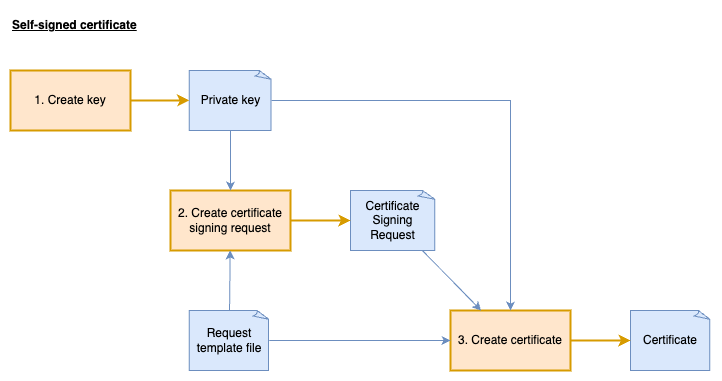

# Self-signed certificates

Self-signed certificates are digital certificates that are created, issued, and signed by the same entity whose identity they certify, rather than by a trusted Certificate Authority (CA). While they provide the same encryption capabilities as CA-issued certificates, they lack third-party validation, causing browsers and clients to display trust warnings. Self-signed certificates are primarily useful for development environments, internal services, and testing scenarios where external validation isn't required.



## Private key

A private key is the secure cryptographic component that allows you to prove ownership of a certificate, decrypt data encrypted with the corresponding public key, and digitally sign content to verify your identity—it must be kept confidential at all times.

> Note: Private keys should never be committed to version control systems like GitHub, stored unencrypted on disk in deployed environments, or passed into an application on the CLI. Instead, use secure key storage solutions like key vaults.

**Create the key:**

The following command will create 2048 bit RSA key:
```bash
openssl genrsa -out docker/ssl/selfsigned.key 2048
```

**Check the details of the key:**

```bash
openssl pkey -in docker/ssl/selfsigned.key -text -noout

openssl asn1parse -in docker/ssl/selfsigned.key

openssl rsa -in docker/ssl/selfsigned.key -outform DER  2>/dev/null | xxd -c 1 -s 0 -l 30 --decimal
```

**Signing data and verification:**

The private key serves a crucial role in digital signatures, allowing you to sign data in a way that proves authenticity. Below is a practical demonstration of this process:

First, create the public key from the private key:
```bash
openssl pkey -in docker/ssl/selfsigned.key -pubout -out docker/ssl/selfsigned.public.key
```

Create a sample file and sign it with the private key:
```bash
echo "test data" > signing-test.txt
openssl dgst -sha256 -sign docker/ssl/selfsigned.key -out signing-test.sig signing-test.txt
```

Verify the signature using only the public key:
```bash
openssl dgst -sha256 -verify docker/ssl/selfsigned.public.key -signature signing-test.sig signing-test.txt
```

If the file is modified after signing, the verification will fail, demonstrating how digital signatures detect data tampering:
```bash
echo "extra data" >> signing-test.txt
openssl dgst -sha256 -verify docker/ssl/selfsigned.public.key -signature signing-test.sig signing-test.txt
```


## Certificate signing request

A Certificate Signing Request (CSR) is a formal message sent from an applicant to a Certificate Authority containing the public key and identity information to be included in the certificate, which allows the CA to verify the requestor's identity and generate a signed certificate.

While not strictly necessary, using a CSR for self-signed certificates provides valuable separation between key generation and certificate creation, maintains consistency with standard certificate practices, and allows for precise configuration of certificate attributes and extensions—making it easier to transition to CA-signed certificates later if needed.

**Create the Certificate Signing Request:**

The following command will create a certificate signing request using details in the [config file](../docker/ssl/selfsigned.cnf) file. View the config file to see what details will be used:

```bash
openssl req -new \
-key docker/ssl/selfsigned.key \
-config docker/ssl/selfsigned.cnf \
-out docker/ssl/selfsigned.csr
```

**View the signing request:**
```bash
openssl req -in docker/ssl/selfsigned.csr -text -noout

openssl asn1parse -in docker/ssl/selfsigned.csr
```


## Create the certificate

**Create the certificate:**

The following command will create a certificate with 365 days validity:

```bash
openssl x509 -req \
-days 365 \
-in docker/ssl/selfsigned.csr \
-signkey docker/ssl/selfsigned.key \
-out docker/ssl/selfsigned.crt \
-extfile docker/ssl/selfsigned.cnf
```

**Read details of the certificate:**
```bash
openssl x509 -in docker/ssl/selfsigned.crt -text -noout
```

**Compare the signing request to the certificate:**
```bash
openssl req -in docker/ssl/selfsigned.csr -text -noout > selfsigned.csr.txt

openssl x509 -in docker/ssl/selfsigned.crt -text -noout > selfsigned.crt.txt

diff --color=always --side-by-side selfsigned.csr.txt selfsigned.crt.txt
git diff --no-index --word-diff selfsigned.csr.txt selfsigned.crt.txt
```

> Note: the `diff --color=always --side-by-side` only colours added/removed lines, it does not show modified lines. The `git diff` will show modified lines. 


## Verify certificates key

To validate a self-signed certificate's authenticity, OpenSSL verifies that the certificate's signature was created using the private key corresponding to the public key contained within the certificate itself. This process confirms the certificate is self-contained and legitimate. The following command performs this verification by treating the certificate as both the certificate to verify and its own trusted CA:
```bash
openssl verify -CAfile docker/ssl/selfsigned.crt docker/ssl/selfsigned.crt
```

The certificates public key can also be compared against the actual public key:
```bash
# View certificates public key
openssl x509 -in docker/ssl/selfsigned.crt -pubkey -noout | openssl pkey -pubin -outform DER | xxd

# View public key created from private key
openssl pkey -in docker/ssl/selfsigned.key -pubout | openssl pkey -pubin -outform DER | xxd
```


## Installing the certificate

**Enable SSL in nginx and restart the container:**

Update the [nginx config](../docker/nginx.conf) and restart the container:
```
server {
    listen 80 ssl;
    server_name server-one;

    ssl_certificate     /etc/nginx/ssl/selfsigned.crt;
    ssl_certificate_key /etc/nginx/ssl/selfsigned.key;
    ssl_protocols       TLSv1.2 TLSv1.3;
    ssl_ciphers         HIGH:!aNULL:!MD5;

    ....
}
```

**Make a HTTPs request to the server:**

> Note: *This will return an untrusted certificate error*

```bash
curl --resolve server-one:10000:127.0.0.1 https://server-one:10000/
```

The SSL certificate warning can be bypassed using the `--insecure` flag, but this practice undermines security by accepting untrusted certificates and should be avoided:
```bash
curl --resolve server-one:10000:127.0.0.1 https://server-one:10000/ --insecure
```

Instead, provide the self-signed certificate as a trusted CA to the client:
```bash
curl --cacert docker/ssl/selfsigned.crt --resolve server-one:10000:127.0.0.1 https://server-one:10000/
```

**Request on different domain name:**

The original certificate was created specifically for the `server-one` domain name. However, our server is accessible through multiple hostnames and IP addresses including `localhost`, `127.0.0.1`, and also used for `server-two`. Try these commands to see how certificate validation fails when the hostname doesn't match what's in the certificate:

```bash
curl --cacert docker/ssl/selfsigned.crt https://localhost:10000/

curl --cacert docker/ssl/selfsigned.crt https://127.0.0.1:10000/

curl --cacert docker/ssl/selfsigned.crt --resolve server-two:10000:127.0.0.1 https://server-two:10000/
```

### Subject Name Alternatives

The self-signed certificate was originally created with only the server-one domain name, causing SSL verification to fail when accessing the server via localhost, even though the server itself defaults to serving the server-one content. This hostname mismatch triggers certificate validation errors because the certificate doesn't include all the names used to access the server.

To solve this problem, we can add Subject Alternative Names (SANs) to the certificate, allowing it to be valid for multiple domain names and/or IP addresses: [config](../docker/ssl/selfsigned-2.cnf).

**Create the Certificate Signing Request:**
```bash
openssl req -new \
-key docker/ssl/selfsigned.key \
-out docker/ssl/selfsigned-2.csr \
-config docker/ssl/selfsigned-2.cnf
```

**Compare with the first Certificate Signing Request:**
```bash
openssl req -in docker/ssl/selfsigned-2.csr -text -noout > selfsigned-2.csr.txt

diff --color=always --side-by-side selfsigned.csr.txt selfsigned-2.csr.txt
git diff --no-index --word-diff selfsigned.csr.txt selfsigned-2.csr.txt
```

**Create the certificate:**
```bash
openssl x509 -req \
-days 365 \
-in docker/ssl/selfsigned-2.csr \
-signkey docker/ssl/selfsigned.key \
-out docker/ssl/selfsigned-2.crt \
-extensions req_ext \
-extfile docker/ssl/selfsigned-2.cnf
```

**Read details of the certificate:**
```bash
openssl x509 -in docker/ssl/selfsigned.crt -text -noout > selfsigned-2.crt.txt

diff --color=always --side-by-side selfsigned.crt.txt selfsigned-2.crt.txt
git diff --no-index --word-diff selfsigned.crt.txt selfsigned-2.crt.txt
```

**Check the supported hosts:**

```bash
openssl x509 -in docker/ssl/selfsigned-2.crt -noout -checkhost server-one
openssl x509 -in docker/ssl/selfsigned-2.crt -noout -checkhost server-two
openssl x509 -in docker/ssl/selfsigned-2.crt -noout -checkhost localhost
openssl x509 -in docker/ssl/selfsigned-2.crt -noout -checkip 127.0.0.1

openssl x509 -in docker/ssl/selfsigned-2.crt -noout -checkhost server-three
```

**Testing the new certificate:**

Update **both** server configs in [nginx config](../docker/nginx.conf) to use the new certificate and restart the container:
```conf
server {
    listen 80 ssl;
    server_name server-one;

    ssl_certificate     /etc/nginx/ssl/selfsigned-2.crt;
    ssl_certificate_key /etc/nginx/ssl/selfsigned.key;
    ...
}
server {
    listen 80 ssl;
    server_name server-two;

    ssl_certificate     /etc/nginx/ssl/selfsigned-2.crt;
    ssl_certificate_key /etc/nginx/ssl/selfsigned.key;
    ...
}
```

Then try the following commands:
```bash
curl --cacert docker/ssl/selfsigned-2.crt --resolve server-one:10000:127.0.0.1 https://server-one:10000

curl --cacert docker/ssl/selfsigned-2.crt -H 'Host: server-one' https://localhost:10000/ 

curl --cacert docker/ssl/selfsigned-2.crt -H 'Host: server-two' https://localhost:10000/ 
```

While using Subject Alternative Names works for a limited number of hosts, it requires updating and redistributing the certificate whenever a new server is added. A more scalable approach is to establish a private Certificate Authority (CA), which allows you to issue individual certificates for each server while clients need only trust the single CA certificate. This CA-based infrastructure provides more flexibility and better security management for growing environments.
